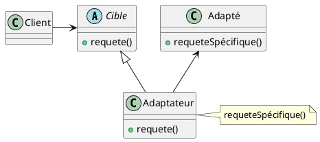
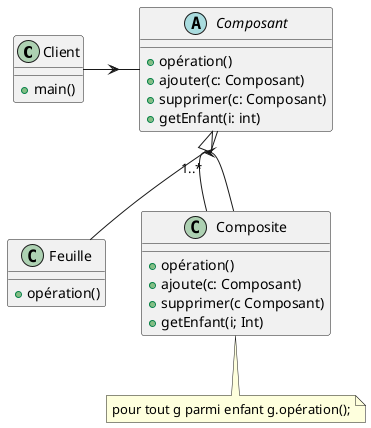
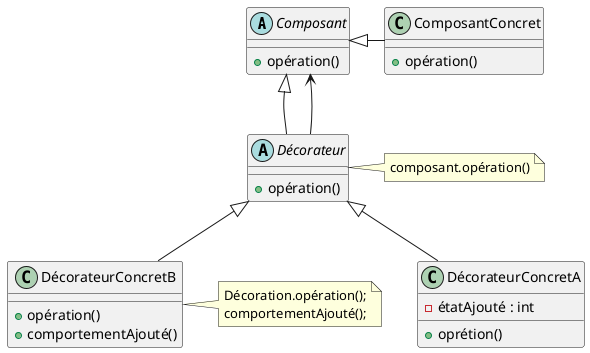
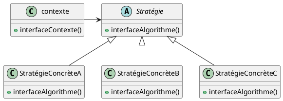
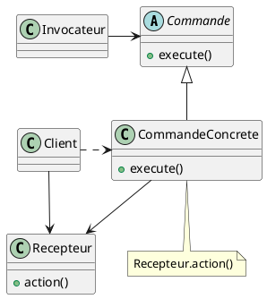
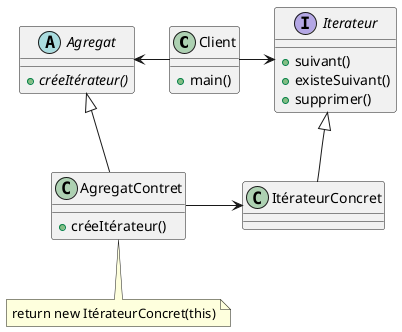
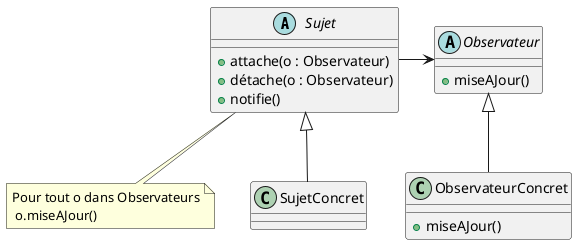
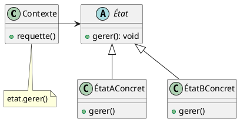
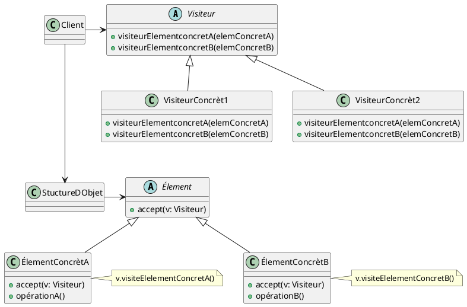

## C’est quoi ?

Les patterns offrent des solutions à des problèmes récurrents rencontrés par les développeurs, Ils permettent de :

- Limiter le couplage
- Faciliter la maintenance
- Être moins rigide face au changement

Ils sont indispensables à connaître pour le développeur :

- Pour s’assurer d’une meilleure conception
- Pour dialoguer avec les développeurs (à travers le “langage pattern”)
- Pour comprendre les frameworks

Un livre écrit par le [GoF (Gang of Four : Erich Gamma, Richard Helm, Ralph Johnson, John Vlissides)](https://fr.wikipedia.org/wiki/Patron_de_conception) décrit 23 Design Patterns appliqués à la conception orientée objet, classés en trois catégories :

## Creational patterns

Les patterns de **création**, relatifs à la création d’objet.

### Singleton

Une seule instance d’une classe.

### Prototype

- Clone,
- Héritage de prototype

### Builder

- Construire un objet avec plusieurs éléments choisi (recette de cuisine).
- Permet de construire un objet complexe étape par étape.
- Le constructeur est appelé à chaque étape de la construction de l'objet.  
- Le client n'a pas besoin de connaître les étapes de construction de l'objet, il suffit de lui fournir un objet de construction. Le pattern Builder est utilisé pour construire des objets complexes étape par étape. Il permet de séparer la construction d'un objet complexe de sa représentation finale, de sorte que le même processus de construction puisse créer différentes représentations.

### Factory

Fabrique des objets en fonction d’un paramètre.

### Abstract factory

Fabrique des objets en fonction d’un paramètre, mais avec plusieurs usines, Par exemple pour implémenter une charte graphique : il existe une fabrique qui retourne des objets (boutons, menus) dans le style de Windows, une qui retourne des objets dans le style de Motif, et une dans le style de Macintosh. Une fabrique abstraite est obtenue en utilisant une fabrique simple.

## Structural patterns

Les patterns **structuraux**, qui structurent l’organisation des classes entre elles, comment elles sont liées.

### Adapter

Adapte une interface à une autre:

- On veut utiliser une classe existante, mais dont l’interface ne coïncide pas avec celle escompté.
- On souhaite créer une classe réutilisable qui collabore avec des classes sans relations avec elle et encore inconnues, c’est-à-dire avec des classes qui n’auront pas nécessairement des interfaces compatibles.
- On a besoin d’utiliser plusieurs sous-classes existantes, mais l’adaptation de leur interface par dérivation de chacune d’entre elles est impraticable. Un adaptateur peut adapter l’interface de sa classe parente.

### Composite

Permet d’agencer les objets dans des arborescences afin de pouvoir traiter de la même et unique façon les objets individuels et les combinaisons de ceux-ci. *un objet contient d’autres objets* :

- Un système de fichier
- Des objets graphiques (conteneurs et éléments graphiques élémentaire)
- DOM

### Decorator

Un objet contient un autre objet, et ajoute des fonctionnalités *surchargeant les méthodes.*
Permet d'ajouter des fonctionnalités à un objet de manière dynamique.

### Facade

Permet de fournir une interface unifiée pour un ensemble d'interfaces dans un sous-système.

## Behavioral patterns

Les patterns **comportementaux**, qui définissent la communication entre objets.

### Strategy

Permet de définir une famille d'algorithmes, encapsuler chacun d'eux et les rendre interchangeables. En général, les clients créent un objet StrategieConcrete, et le passent au contexte, par la suite les clients interagissent exclusivement avec le contexte.

### Command

Un objet encapsule une commande, et peut l’exécuter, encapsuler une demande sous la forme d'un objet, ce qui permet de paramétrer les clients avec différentes demandes.

### Iterator

Permets de parcourir les éléments d’une collection sans révéler sa représentation interne (liste, pile, arbre, etc.).
Même appel pour n'importe quel type de collection, en java on utilise l'interface Iterable et l'interface Iterator
`java.util.Iterator` et `java.lang.Iterable`

### Observer

Permet à un objet de surveiller l'état d'un autre objet et d'être informé lorsque cet état change, Le design pattern Observer est utilisé pour établir une relation de type "un-à-plusieurs" entre des objets, où un objet principal, appelé "sujet" (ou "observable"), informe plusieurs autres objets, appelés "observateurs", lorsqu'il subit un changement d'état. L'idée est de définir une relation de dépendance entre ces objets sans les coupler de manière rigide. Cela permet de mettre à jour automatiquement les observateurs lorsque le sujet change d'état, sans avoir à les relier explicitement.

### Mediator

Un objet centralise la communication entre plusieurs, objets, associe un objet à un autre (centrale d'avion).

### State

Un objet change de comportement en fonction de son état (ex: un bouton qui change de couleur en fonction de son état).
Modélise des objets dont le comportement varie en fonction de leur état interne. L'idée est de définir une classe abstraite représentant l'état général d'un objet, et des sous-classes concrètes représentant les différents états spécifiques. Chaque état peut définir ses propres comportements pour les différentes méthodes de l'objet. L'objet principal, appelé "contexte", maintient une référence à un objet d'état particulier, qui détermine le comportement actuel de l'objet. En modifiant l'état du contexte, on peut modifier le comportement de l'objet.

### Visitor

Utilisez le pattern Visiteur quand vous voulez ajouter des capacités à un ensemble composite d’objets et que l’encapsulation n’est pas importante.
Le Visiteur doit parcourir chaque élément du Composite : cette fonctionnalité se trouve dans un objet Navigateur. Le Visiteur est guidé par le Navigateur et recueille l’état de tous les objets du Composite. Une fois l’état recueilli, le Client peut demander au Visiteur d’exécuter différentes opérations sur celui-ci. Quand une nouvelle fonctionnalité est requise, seul le Visiteur doit être modifié.

- Permet d’ajouter des opérations à la structure d’un Composite sans modifier la structure elle-même.
- L’encapsulation des classes du Composite est brisée.
- Comme une fonction de navigation est impliquée, les modifications de la structure du Composite sont plus difficiles.

## Les inconvénients des patterns

- Ils occasionnent plus de classes
- Ils peuvent être peu adaptés dans des environnements dit “limités” (comme Android)
- c’est à encapsuler ce qui varie.
- Ce principe nous enseigne à limiter chaque classe à une seule responsabilité. (Cohésion)
- Nous savons que nous devons éviter comme la peste de changer quelque chose à une classe (Couplage)

## Autres patrons de conception

### Object Pool

Ce patron permet d'économiser les temps d'instanciation et de suppression lorsque de nombreux objets ont une courte durée d'utilisation. Il consiste à administrer une collection d'objets qui peuvent être recyclés. Une méthode du Pool délivre un objet soit par une nouvelle instanciation, soit par recyclage d'un objet périmé. Lorsque les objets arrivent à la fin de leur cycle de vie, ils sont remis à la disposition du Pool pour un futur recyclage. Dans la phase d'instanciation, le Pool peut instancier plus d'un objet à la fois si l'algorithme d'instanciation a une complexité meilleure que O(n). Le patron Object Pool est particulièrement utile lorsque le nombre total de cycles de vie est très grand devant le nombre d'instances à un moment précis et que les opérations d'instanciation et/ou suppression sont coûteuses en temps d'exécution par rapport à leur recyclage.

### Modèle-vue-contrôleur

Combinaison des patrons observateur, stratégie et composite, ce qui forme ainsi un patron d'architecture.

### Inversion de contrôle

### Injection de dépendances

## Les principes de conception Orientée Objet

### Principe Ouvert-Fermé

> Les classes doivent être ouvertes à l’extension mais fermées au changement.

- Ouvert à l’ajout de code
- Fermé aux modifications du code existant
- Ne pas modifier le code qui fonctionne, ce qui est stable doit rester stable.

### Principe d’inversion des dépendances

> Dépendez des abstractions et non des classes concrètes.

- Les modules de haut niveau ne doivent pas dépendre des classes concrètes d’un module de bas niveau
- Les deux doivent dépendre d’abstraction

### Principe d’Hollywood

> “Ne nous appelez pas, nous vous appelerons.”

Les composants de bas niveau doivent s’adapter à un système, mais ce sont les composants de haut niveau qui déterminent quand appeler les composants de bas niveau.

Hollywood correspond aux composants de haut niveau, les acteurs correspondent aux composants de bas niveau. C’est Hollywood qui appelle les acteurs.

### Autres principes en vrac

- Programmez des interfaces
- Encapsulez ce qui varie
- Couplez faiblement vos objets
- Préférez la composition à l’héritage (“à un” plutôt que “est un”)
- Une classe = Une responsabilité
- Qui est responsable de ?

***

## source

- wikipedia
- headfirst : design patterns
- mes cours
- Fiche de revision de Théo
